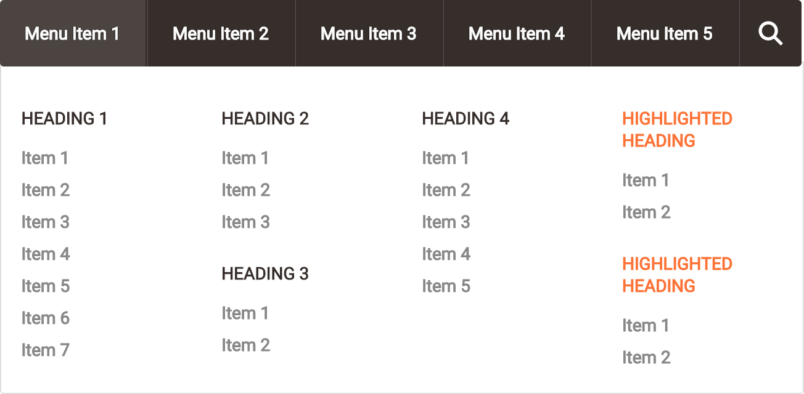

# Mega Nav in CSS

A simple mega nav menu in pure CSS.


### Mega Wut?

Mega navs are an effective feature for large menu content and surprisingly easy to implement. If you've wanted to put one together but didn't know where to start, this quick walkthrough is for you.


### How'd You Do It?

This implementation uses just CSS and nothing else. The mega nav is hidden until you hover over the menu item:

```css
.mega-menu {
  background: #fff;
  border: 1px solid #ddd;
  border-radius: 0 0 3px 3px;
  opacity: 0;
  position: absolute;
  transition: all .3s ease .15s;
  visibility: hidden;
  width: 100%;
}

li:hover > .mega-menu {
  opacity: 1;
  overflow: visible;
  visibility: visible;
}
```

And voila...



This implementation also uses ARIA [landmark roles](http://www.w3.org/TR/wai-aria/roles#landmark_roles) following [WCAG 2.0](http://www.w3.org/TR/WCAG/) compliance for accessibility.


### Support

Current versions of Chrome, Firefox, Safari, Edge, and IE8+.


### License

[The MIT License (MIT)](https://github.com/AllThingsSmitty/mega-nav/blob/master/LICENSE)